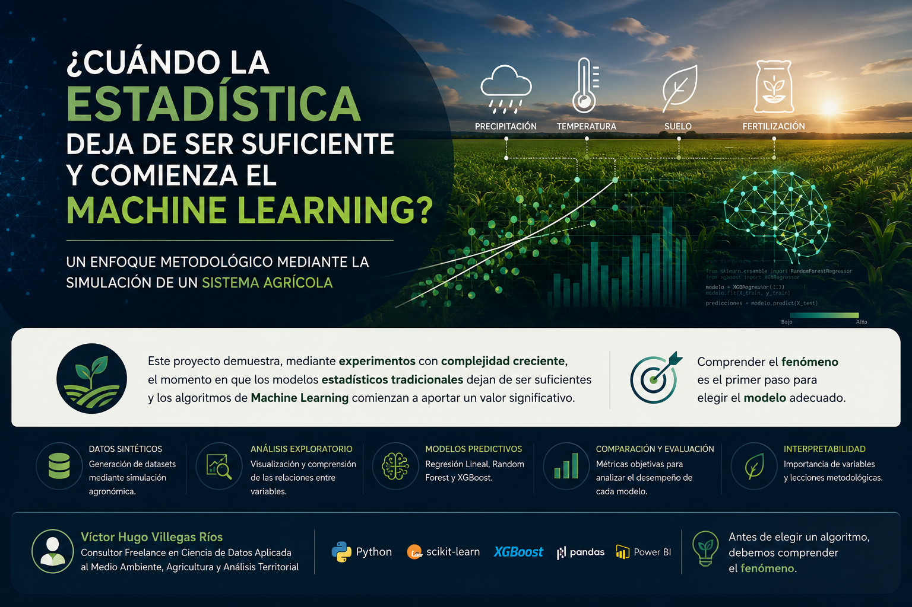

<p align="center">



</p>

# ¿Cuándo la estadística deja de ser suficiente y comienza el Machine Learning?

## ...un framework metodológico basado en experimentos con complejidad creciente.

<p align="center">


</p>

---

# Resumen Ejecutivo

La elección entre modelos estadísticos tradicionales y algoritmos de Machine Learning constituye una de las decisiones metodológicas más importantes dentro de cualquier proyecto de Ciencia de Datos.

Sin embargo, esta decisión suele basarse en la comparación de algoritmos o métricas predictivas, dejando en segundo plano la comprensión del fenómeno que se desea modelar.

Este proyecto propone un enfoque diferente.

Mediante el diseño de un **Motor de Simulación Agronómica**, se construyen cuatro experimentos con niveles crecientes de complejidad para demostrar, mediante evidencia, el momento en que la Regresión Lineal deja de ser suficiente y los algoritmos de Machine Learning comienzan a aportar un valor significativo.

Más que comparar algoritmos, este trabajo propone una metodología para seleccionar modelos predictivos de acuerdo con la complejidad del fenómeno analizado.

---

# La pregunta de investigación

> **¿Cuándo la estadística deja de ser suficiente y comienza el Machine Learning?**

Esta investigación responde dicha pregunta mediante un enfoque experimental basado en simulación, análisis exploratorio de datos y comparación de modelos predictivos.

---

# ¿Por qué este proyecto es diferente?

La mayoría de los proyectos de Machine Learning siguen el siguiente flujo:

```text
Dataset

↓

Entrenar modelos

↓

Comparar métricas
```

En este trabajo se propone un enfoque diferente:

```text
Conocimiento del dominio

↓

Modelo conceptual

↓

Motor de Simulación Agronómica

↓

Generación del dataset

↓

Análisis Exploratorio de Datos (EDA)

↓

Modelado predictivo

↓

Interpretabilidad

↓

Lecciones metodológicas
```

La selección del modelo deja de depender de la popularidad del algoritmo y pasa a depender de la complejidad del fenómeno.

---

# Objetivos

## Objetivo General

Analizar la transición entre la Estadística Tradicional y el Machine Learning mediante un sistema agrícola simulado.

## Objetivos Específicos

- Diseñar un Motor de Simulación Agronómica.
- Construir datasets con complejidad creciente.
- Aplicar técnicas de EDA.
- Entrenar modelos predictivos.
- Comparar métricas de desempeño.
- Analizar la importancia de variables.
- Extraer lecciones metodológicas.

---

# Metodología

El desarrollo del proyecto sigue siete etapas:

1. Diseño conceptual del sistema agrícola.
2. Simulación del conjunto de datos.
3. Análisis Exploratorio de Datos.
4. Construcción de modelos predictivos.
5. Comparación del desempeño.
6. Interpretabilidad del Machine Learning.
7. Lecciones metodológicas.

---

# Arquitectura metodológica

```text
Comprensión del fenómeno
          │
          ▼
Modelo conceptual
          │
          ▼
Motor de Simulación Agronómica
          │
          ▼
Generación del dataset
          │
          ▼
Análisis Exploratorio de Datos
          │
          ▼
Machine Learning
          │
          ▼
Interpretabilidad
          │
          ▼
Lecciones metodológicas
```

---

# Experimentos desarrollados

| Experimento | Complejidad | Resultado |
|-------------|------------|-----------|
| Experimento 1 | Baja | La Regresión Lineal es suficiente |
| Experimento 2 | Baja-Media | La Regresión Lineal continúa siendo competitiva |
| Experimento 3 | Media | El Machine Learning comienza a aportar ventajas |
| Experimento 4 | Alta | XGBoost y Random Forest superan claramente a la Regresión Lineal |

---

# Resultados principales

✔ La complejidad del fenómeno determina la complejidad del modelo.

✔ La Estadística y el Machine Learning no compiten; se complementan.

✔ Comprender el sistema es más importante que entrenar muchos algoritmos.

✔ El EDA constituye una etapa fundamental del proceso.

✔ La interpretabilidad fortalece la confianza en los modelos predictivos.

---

# Tecnologías utilizadas

- Python
- Pandas
- NumPy
- Matplotlib
- Scikit-Learn
- XGBoost
- Jupyter Notebook

---

# Estructura del repositorio

```text
📂 notebooks/
📂 data/
📂 src/
📂 figures/
📂 docs/
📂 article/
📂 assets/
README.md
LICENSE
requirements.txt
```

---

# Cómo ejecutar el proyecto

```bash
git clone https://github.com/usuario/repositorio.git

cd repositorio

pip install -r requirements.txt

jupyter notebook
```

---

# Productos derivados

Este proyecto forma parte de una línea de investigación orientada a integrar Ciencia de Datos, Machine Learning y conocimiento del dominio.

Los productos derivados incluyen:

- Notebook profesional.
- Artículo técnico.
- Resumen Ejecutivo.
- Presentación profesional.
- Infografía metodológica.
- Código modular.
- Framework metodológico.

---

# Roadmap

- Publicación del artículo.
- Aplicación con datos agrícolas reales.
- Extensión hacia problemas ambientales.
- Publicación de nuevos estudios de caso.
- Evolución del framework metodológico.

---

# Autor

## Víctor Hugo Villegas Ríos

**Consultor Freelance en Ciencia de Datos Aplicada al Medio Ambiente, Agricultura y Análisis Territorial**

**Especialidades**

- Ciencia de Datos
- Machine Learning
- Python
- Power BI
- Medio Ambiente
- Recursos Naturales
- Agricultura
- Analítica Territorial

---

# Licencia

Este proyecto se distribuye bajo la licencia MIT.

---

# Cómo citar este trabajo

Villegas Ríos, V. H.

**¿Cuándo la estadística deja de ser suficiente y comienza el Machine Learning? Un enfoque metodológico mediante la simulación de un sistema agrícola.**

GitHub Repository.

---

> **"Antes de elegir un algoritmo, debemos comprender el fenómeno. Porque los modelos cambian, las herramientas evolucionan y la tecnología avanza; pero el verdadero conocimiento siempre comienza entendiendo el sistema que queremos explicar."**
